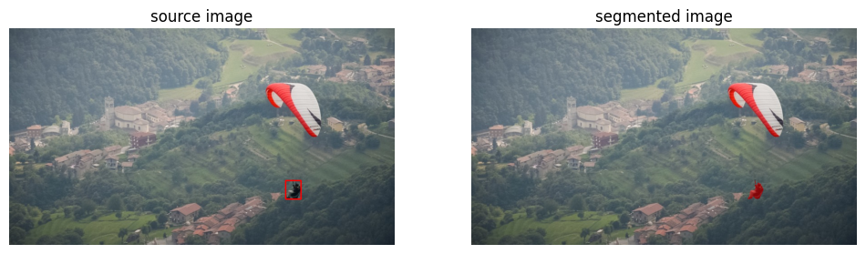

# Textual Prompts Object Removal for Video Impainting

Project for the 'Advanced Computer Vision' course of the Master's Degree in Artificial Intelligence Systems at the University of Trento, A.Y. 2023/2024.

## Description

In this (project)[ADV_CV_Propainter.pdf] we proposed an efficient way to automate the generation of video sequence masks using state of the art pre-trained models.
The cascade of models will achieve textual-prompts video impainting.

#### You Only Look Once (YOLO)
The Yolo model has been used to achieve Object detection in scene sequences
for further details: [Yolo Paper](https://arxiv.org/pdf/1506.02640.pdf)

#### Contrastive Language–Image Pre-training (CLIP)
Clip model has been used to achieve textual-prompt object selection
for further details visit the website: [Clip Project](https://openai.com/research/clip)

#### Segment-Anything Model (SAM)
for further details visit the website: [Sam Project](https://segment-anything.com/)

#### Improving Propagation and Transformer for Video Inpainting (ProPainter)
Visit the [Original Project Page](https://shangchenzhou.com/projects/ProPainter/) for further details.

## Results

#### Textual Segmentation
<table>
<tr>
   <td> 
      
   </td>
</tr>
</table>


#### Prompt: *The red glyder*
<table>
<tr>
   <td> 
      
   </td>
   <td> 
      
   </td>
</tr>
</table>

#### Prompt: *The person with white shirt*
<table>
<tr>
   <td> 
      
   </td>
   <td> 
      
   </td>
</tr>
</table>

## Installation
1. To avoid possible conflicts, it is recommended to use a **virtual environment** to install the required packages. 
    ```
    python3 -m venv venv
    source venv/bin/activate
    ``` 

2. To install the project, clone the repository and install the required packages with the following command:
    ```
    pip install -r requirements.txt
    ```
    
3. Before running the program make sure to clone the official repository from the [ProPainter's official github page.](https://github.com/sczhou/ProPainter)
    ```
    git clone https://github.com/sczhou/ProPainter.git
    ``` 

4. Before running the program make sure to download SAM's pretrained weights
    ```
    wget -q https://dl.fbaipublicfiles.com/segment_anything/sam_vit_h_4b8939.pth
    ``` 

## How to run the program

The program can be run with the following command:

    ```
    python3 propainter.py -d <video-path> [-h_res <True>] [-display <False>]
    ```

  - Help:
      ```
      python3 <program.py> -h
      ```

**Note:** The video result of the inpainting will be saved in the folder ```results```.

## Authors
[Giovanni Scialla](https://github.com/MisterMandarino) [Mattia Nardon](https://github.com/Mattia-Nardon)
 
